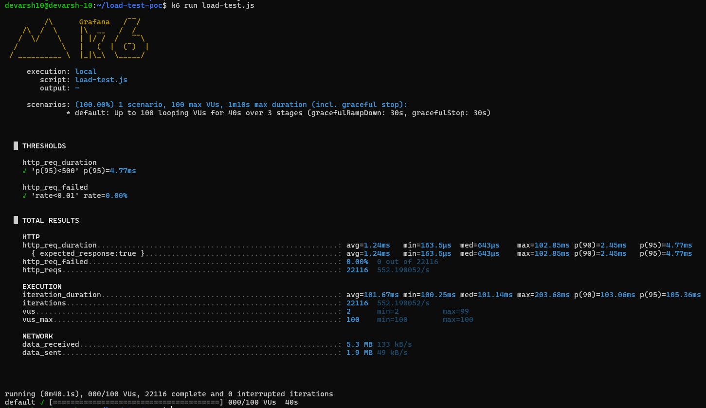

# load-test-poc

A performance testing proof of concept that runs **k6 load tests automatically inside a CI/CD pipeline** — spinning up a real Kubernetes cluster (Minikube), deploying the app, and gating the deployment based on latency and error rate thresholds.

Built during my time at DevEnvs to validate the idea of correlating code changes with production performance degradation.

---

## What This Does

Most load tests are run manually after deployment. This repo flips that — load testing is a **CI gate**. A pull request that degrades performance beyond defined thresholds fails the pipeline before it merges.

**Pipeline flow:**
1. GitHub Actions spins up Minikube in CI
2. Builds and deploys the Node.js app to Kubernetes via `deployment.yaml`
3. Installs k6 and runs `load-test.js` against the live service
4. Extracts avg latency and success rate from results
5. Posts a summary comment directly on the PR

---

## Load Test Configuration

```js
export let options = {
  stages: [
    { duration: '10s', target: 50 },   // ramp up to 50 VUs
    { duration: '20s', target: 100 },  // sustain at 100 VUs
    { duration: '10s', target: 0 },    // ramp down
  ],
  thresholds: {
    http_req_duration: ['p(95)<500'],  // 95th percentile must be under 500ms
    http_req_failed: ['rate<0.01'],    // error rate must stay below 1%
  },
};
```

**Why thresholds matter:** Without them, k6 always exits with code 0. Thresholds make k6 exit non-zero on failure — which is what causes the CI pipeline to actually block a bad deployment.

**Why staged load:** Ramping up simulates realistic traffic patterns. Constant load (all VUs at once) is a stress test, not a performance test. Staged load catches latency degradation that only appears as concurrency grows.

---

## Test Results

Local run against the Node.js app — 100 virtual users, 40 seconds, 3 stages:



| Metric | Result | Threshold | Status |
|---|---|---|---|
| p(95) latency | 4.77ms | < 500ms | ✅ Pass |
| Error rate | 0.00% | < 1% | ✅ Pass |
| Total requests | 22,116 | — | — |
| Throughput | 552 req/s | — | — |
| Max latency | 102.85ms | — | — |

> **Note:** These numbers reflect a localhost run (no network latency, no real DB). In a staging environment with realistic payloads and network hops, you'd expect p95 in the 50–200ms range depending on the stack. The value here is validating the pipeline and threshold mechanism, not the absolute numbers.

---

## Stack

- **k6** — load testing engine
- **GitHub Actions** — CI pipeline
- **Minikube** — local Kubernetes cluster in CI
- **Kubernetes + Helm** — deployment target
- **Node.js / Express** — the app being tested

---

## How to Run Locally

**1. Start the app:**
```bash
npm install
node app.js
# App runs on http://127.0.0.1:8080
```

**2. Install k6:**
```bash
# Ubuntu/Debian
sudo apt-get install k6

# macOS
brew install k6
```

**3. Run the load test:**
```bash
k6 run load-test.js
```

You'll see a full results summary with latency percentiles, throughput, and threshold pass/fail status.

---

## Relevance to Production QA

This PoC demonstrates:
- **API performance validation** with SLO-based thresholds (p95, error rate)
- **CI/CD quality gates** — blocking merges that regress performance
- **Concurrent user simulation** with staged ramp-up patterns
- **Backend bottleneck identification** via latency distribution (avg vs p90 vs p95 vs max)
- **Kubernetes deployment validation** — testing against a real deployed service, not a mock
